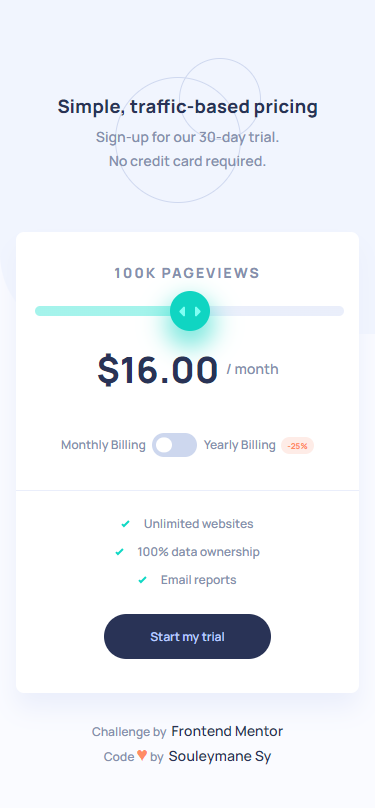

# Frontend Mentor - Interactive pricing component

## Welcome! 👋

Thanks for checking out this front-end coding challenge.

[Frontend Mentor](https://www.frontendmentor.io) challenges help you improve your coding skills by building realistic projects.

## Table of contents

- [The challenge](#the-challenge)
- [Page view and pricing totals](#page-view-and-pricing-totals)
- [Screenshot](#screenshot)
- [Links](#links)
- [Built with](#built-with)
- [Author](#author)

## The challenge

The challenge is to build out this interactive pricing component and get it looking as close to the design as possible.

Users should be able to:

- View the optimal layout for the app depending on their device's screen size
- See hover states for all interactive elements on the page
- Use the slider and toggle to see prices for different page view numbers (details provided below)

### Page view and pricing totals

Here are the different page view ranges and the corresponding monthly price totals:

- 10K pageviews / $8 per month
- 50K pageviews / $12 per month
- 100K pageviews / $16 per month
- 500k pageviews / $24 per month
- 1M pageviews / $36 per month

If the visitor switches the toggle to yearly billing, a 25% discount should be applied to all prices.

## Screenshot

### Mobile

### Tablets

### Desktop

### Desktop Active

### Links

- Demo URL: [Demo URL here](https://fem-interactive-pricing-component-eight.vercel.app/)
- Solution URL: [Solution URL here](https://www.frontendmentor.io/solutions/interactive-pricing-component-reactjs-pnpm-vite-and-sass-glgcT_wjQ8)

### Built with

- Semantic HTML5 markup
- CSS custom properties
- SASS
- Flexbox
- CSS Grid
- Mobile-first workflow
- [Vite Js](https://vitejs.dev/) - JS Build Tools
- [PNPM](https://pnpm.io/) - Javacript Package Manager
- [React](https://reactjs.dev/) - Javascript library

## Author

- GitHub - [Souleymane Sy](https://github.com/SouleymaneSy7)
- Frontend Mentor - [@SouleymaneSy7](https://www.frontendmentor.io/profile/SouleymaneSy7)
- Twitter - [@Souleymanesy43](https://twitter.com/Souleymanesy43)
